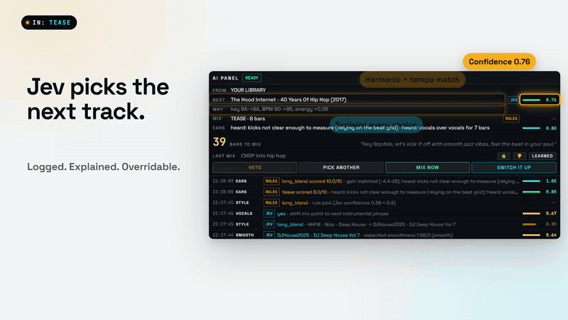

# JevDJ

[](docs/media/jevdj-promo.mp4)

**[Watch the full promo (49s, with sound)](docs/media/jevdj-promo.mp4)** ·
**[Live demo for social (38s, vertical)](docs/media/jevdj-social.mp4)**, a real screen recording of
the app arranging and mixing a set (music: JevDJ Originals, royalty-free)

AI DJ with a Virtual-DJ style interface. Jev (TypeSafe System One) picks every next track and
transition. The browser beat-matches and mixes your own music files with the Web Audio API.
Groq writes and speaks short DJ lines, Spotify-DJ style.

## Run

```bash
# backend (terminal 1)
cd backend
python -m venv .venv
.venv\Scripts\pip install -r requirements.txt
.venv\Scripts\python -m uvicorn app.main:app --reload

# frontend (terminal 2)
cd frontend
npm install
npm run dev          # http://localhost:5173
```

Keys go in `.env` (copy `.env.example`). Without a Jev key everything runs on the rule-based
brain. Without a Groq key the voice uses template lines and the browser's own speech.

## Add music

1. Copy mp3 / wav / flac / aiff / m4a files into `MUSIC_DIR` (default `C:\Users\nqobile\Music`). Subfolders are fine.
2. Press **SCAN** in the library. Each track is analysed once (BPM grid, Camelot key, energy,
   vocal density, safe mix-in/out windows) and cached in SQLite. Shift-click SCAN to re-analyse.
3. Turn **AUTO** on.

Lossless files stay lossless: files are served as-is (AIFF is converted to FLAC for the browser),
mixing runs in 32-bit float, and REC writes 24-bit WAV. Tempo sync resamples, as in any DJ app.

Streaming services (Spotify, Apple Music) cannot be mixed: their audio is DRM protected.
For SA music as files: Traxsource and Beatport (amapiano, afro house, deep house, WAV/FLAC), Bandcamp, iTunes.

Check the analyser against tracks you know:

```bash
cd backend
.venv\Scripts\python -m app.analysis.check "C:\Users\nqobile\Music\some track.mp3"
```

## Try it without music

`backend/dev/make_originals.py` synthesises **JevDJ Originals**: 8 royalty-free amapiano / afro house
tracks (110-120 BPM, mellow to peak-time) that are safe for videos and posts.
`python dev/serve_demo.py originals` runs the backend against them with a separate database.
`backend/dev/make_demo_tracks.py` synthesises 12 test-tone tracks with known BPM and key
(`python dev/serve_demo.py` serves those).
`backend/dev/jev_smoke.py` asks the real Jev one of each question type.

## Controls

| Where | What |
|---|---|
| Top bar | AUTO, vibe (auto / warm-up / build / peak / cool-down), VOICE, REC (24-bit WAV), set export TXT / JSON |
| Decks | CUE, PLAY, SYNC, pitch (+-8%), drag a track onto a deck, click a waveform to seek |
| Mixer | GAIN, HI / MID / LOW (full kill), FILTER (left low-pass, right high-pass), channel faders, crossfader. Double-click resets. MIX ▶ mixes now: pick a move or AUTO (Jev picks) |
| Library | SMART ORDER arranges the whole set (JOURNEY / BUILD / PEAK TIME); the table becomes the queue with an energy arc strip |
| AI panel | VETO, PICK ANOTHER, MIX NOW, SWITCH IT UP, live decision log with confidence |
| Keys | Space play/pause live deck, Q / W cue deck A / B |

Mascot: drop your art at `frontend/public/mascot.png` (or .svg / .gif / .webp) and it replaces
the built-in Jev in the booth. It bobs on the beat, thinks while Jev chooses, works the decks
during a mix and talks when the voice plays.

## SMART ORDER

One tap arranges the whole pool (your library, or the Audius station) into a set:

- **Energy arc**: every slot has a target energy. JOURNEY warms up, peaks around 70% and brings it
  home; BUILD climbs all the way; PEAK TIME puts the hottest block first. Targets are percentiles
  of *your* pool, so the high-energy tracks cluster together whatever the library sounds like.
- **Smooth neighbours**: each pair is scored on Camelot key and tempo; a greedy chain plus a local
  search (segment reversals and moves) minimises rough mixes (`backend/app/brain/order.py`).
- AUTO then plays the order; the set phase follows the arc. Jev still picks every transition and
  the pre-listen still checks every mix. SWITCH IT UP or a manual pick re-arranges the rest of the
  set from what is playing; new tracks get a place automatically.

## How the brain decides

1. Rules pre-filter to <= 20 candidates (BPM +-8% incl. half/double time, Camelot-compatible,
   not in the last 30 plays), relaxing step by step if the library is small.
2. Jev **Choice** picks the next track from text cards, with set phase, last tracks, your
   overrides and your taste memory (genres you let play, tracks you skip) as context.
3. Jev **Score** rates smoothness of the top 3; the smoothest wins.
4. Jev **Choice** picks the transition style and **Noul** checks for vocals at the mix point
   (shifts to the next instrumental phrase if > 0.6).
5. In auto vibe, Jev **Score** moves the set phase every 5 tracks.

Below 0.40 confidence (JEV_CONFIDENCE_THRESHOLD), or offline, `brain/rules.py` decides and the AI panel marks it RULES.

Transitions (all beat-aligned on the outgoing downbeat): `long_blend` (EQ fade, bass swap
halfway), `quick_cut` (high-pass build then cut), `filter_fade` (high-pass sweep out),
`echo_out` (1-beat echo tail, then drop).

## Tests

```bash
cd backend && .venv\Scripts\python -m pytest -q
cd frontend && npx tsc -b
```
